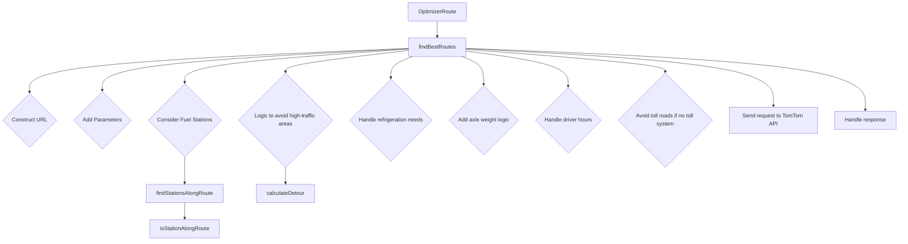
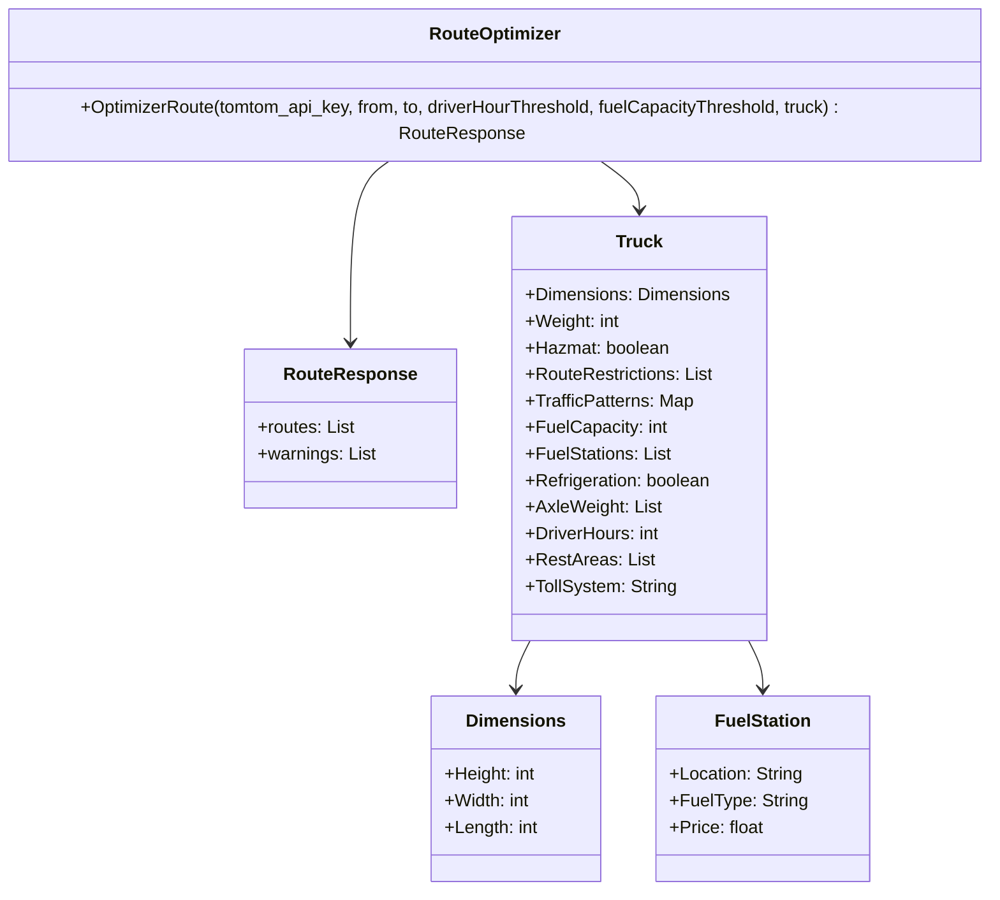

# Travel Path Optimizer

## Overview

The Route Optimizer Engine is designed to enhance route planning for logistics and transportation services. By integrating various critical parameters such as fuel capacity, driver hours, and real-time traffic data, this engine aims to optimize routes for efficiency and compliance with legal standards.

## Features

### Fuel Capacity Management

- **Objective:** Manage refueling needs based on vehicle fuel capacity and range.
- **Implementation:**
  - **Fuel Capacity Consideration:** This parameter does not directly translate into a route parameter for the TomTom API. Instead, potential refueling points are calculated based on the truck's fuel capacity and range.
  - **Route Calculation:** Determines when and where refueling should occur without significantly deviating from the optimal route.

### Driver Hours Regulation

- **Objective:** Ensure compliance with legal driving hours and provide for mandatory rest periods.
- **Implementation:**
  - **Hours of Service Compliance:** Segments the route into multiple parts to ensure drivers operate within legal driving limits.
  - **Rest Period Planning:** Plans rest stops based on continuous driving time and remaining hours in the driver's schedule, incorporating these into the route planning.

### Dynamic Route Planning

- **Objective:** Adjust routes dynamically in response to real-time data and predefined criteria.
- **Implementation:**
  - **Real-time Data Integration:** Integrates real-time traffic and weather data feeds to adjust routes dynamically, enhancing route accuracy and timeliness.
  - **Continuous Re-routing:** If conditions change (e.g., traffic jams, accidents), the engine recalculates the route in real-time to find the best alternative paths.

### Database Integration

- **Objective:** Utilize a comprehensive database to support dynamic routing with updated real-world data.
- **Implementation:**
  - **Data Storage:** Integrates with a database that stores up-to-date information on traffic patterns, weather conditions, and available rest areas.
  - **Data Utilization:** Regularly accesses and updates this database to reflect current conditions in route planning.

### Handling Specific Routing Parameters

- **Objective:** Manage routing parameters that are not directly supported by standard APIs.
- **Implementation:**
  - **Custom Logic Implementation:** For parameters like axle weight or turn radius that are not directly manageable through the TomTom API, custom logic is implemented to filter and evaluate feasible routes.
  - **API Extension:** Develop extensions or additional API layers to handle complex routing scenarios that involve multiple parameters.

### Real-time Adjustments and Decision Making

- **Objective:** Allow for real-time route modifications based on changing conditions and inputs.
- **Implementation:**
  - **Driver Inputs:** Incorporate feedback or commands from drivers to adjust routes according to real-time needs or preferences.
  - **Vehicle Status Monitoring:** Monitor the status of the vehicle to adjust routes based on factors like unexpected vehicle performance issues or maintenance needs.

